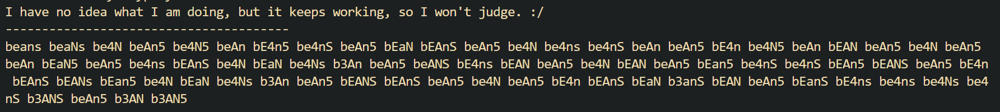

# Bean Cypher (Alpha)

## A very stupid idea, made as an excuse to make something with Rust, no matter how jank.

### (it's very jank)

The Bean Cypher encodes and decodes using *Bean Slang™*. Everything gets converted into and from a bunch of beans.

You can assign 216 unique values, for every possible version of "beans". Characters, symbols, phrases, anything! As long as the sender and receiver have the same values assigned, they can talk to each other while others are confused. Maybe even a bit amazed.

Yeah, it's a glorified look-up table. If someone is devoted enough, they probably can decypher this the same way as they would a substitution cypher. Did I mention this a stupid idea?

## What to download
In the `Releases` page, there are 2 versions - an `.exe` and a template in a `.zip` file. The executable works, however, if you want further customizability than, well, none, you'll need some more files. For that, just download the template. The rest is explained in the `README.txt`, located in the zip.

## How to use
Type the characters in brackets of the desired action. There's some exceptions, but those will be mansplained.

## Contributing to this... thing
Good question. For now just kinda wing it. I'll learn how to have an actual system later, probably when there will be *actual* traffic.

## Special Thanks
- **[Bean Man](https://www.twitch.tv/wolf_ice123)** for being based enough to help me make the initial design document and most of the visual stuff.
- **[Gensokyo Radio](https://gensokyoradio.net)** for keeping me sane while trying to make sense of Rust.